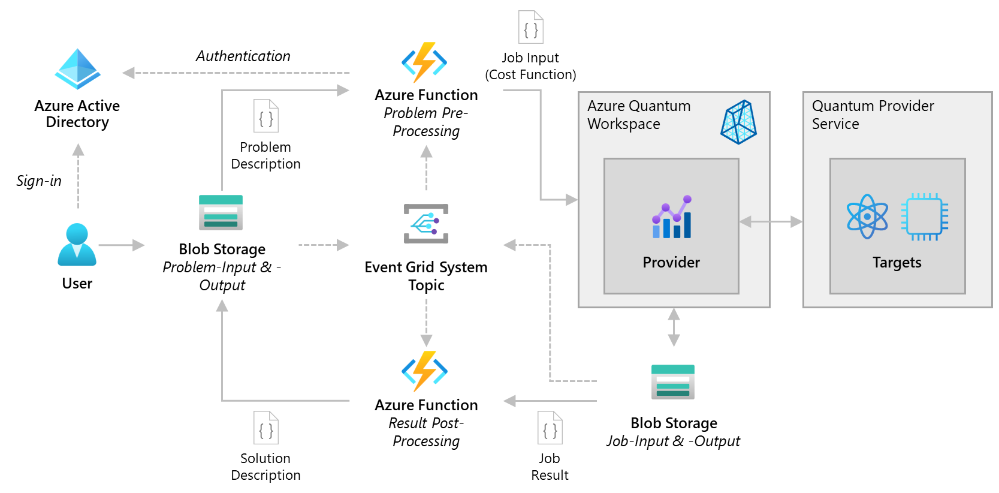

# QIO Job Submission via File Upload
This repo contains everything you need to show how QIO jobs can be submitted by uploading JSON-files to blob storage.



## Getting Started

### Create Azure Credentials

Follow instructions on [Deploy ARM templates by using GitHub Actions](https://docs.microsoft.com/azure/azure-resource-manager/templates/deploy-github-actions) for creating deployment credentials for GitHub. This includes creating a service principal and assigning **Contributor**-role to him.

### Configure Actions secrets

Configure two Actions secrets:

- **AZURE_CREDENTIALS** with the output generated during the service principal creation.
- **AZURE_SUBSCRIPTION** with the Azure subscription ID.

### Change the workflows (if needed)

Following settings might be changed (but in sync in all workflow definitions)

- AZURE_RESOURCE_GROUP_NAME - the resource group the deployment should be targeted to
- AZURE_RESOURCE_GROUP_LOCATION - the region of all deployment artifacts (including the resource group)
- AZURE_FUNCTIONAPP_NAME - name of the application (names of other resources will be derived from)

### Manually trigger the deployment workflow (CI)

Manually trigger following **CI Full Deployment**

### Clean up resources

```AzureCli
    az group delete --name myResourceGroup
```